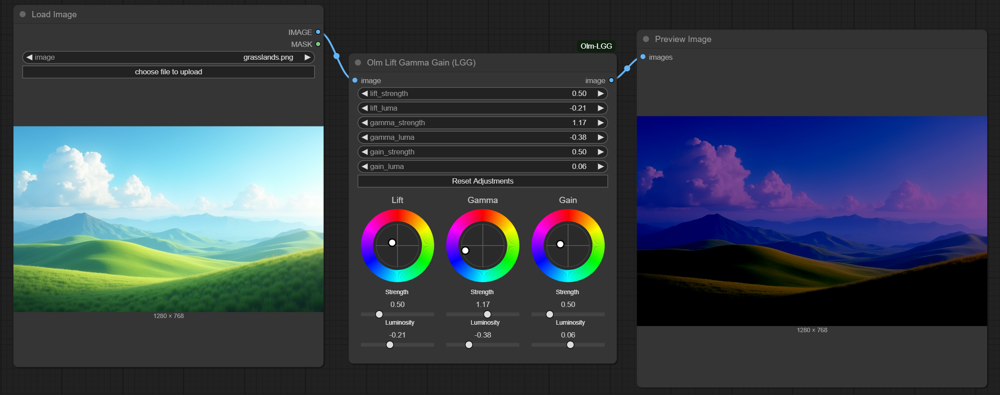

# Olm LGG (Lift, Gamma, Gain) for ComfyUI



A visual, interactive **Lift, Gamma, Gain** color correction node for ComfyUI, tailored for precise color grading workflows.

- **Author:** Olli Sorjonen
- **GitHub:** [github.com/o-l-l-i](https://github.com/o-l-l-i)
- **X:** [@Olmirad](https://x.com/Olmirad)
- **Version:** 1.0.1.1 (Chain original mouse event handlers to maintain subgraph header button functionality in ComfyUI frontend 1.24.4 and later.)

---

## ✨ What Is This?

**Olm LiftGammaGain** brings the power of **professional-style color grading** to ComfyUI with real-time interactivity.

It lets you manipulate shadows (Lift), midtones (Gamma), and highlights (Gain) of an image via intuitive UI elements including color wheels, strength sliders and numeric inputs. Designed to be **live-adjustable**, responsive, and fully integrated into the ComfyUI canvas.

This is a single purpose, one node implementation with minimal dependencies. So if you want this type of color adjustment node without extra bloat, this might be for you.

**Use it for:**

- Fine-tuning image tone and contrast
- Matching lighting and mood across images
- Creative color grading for generative outputs
- Prepping images for compositing or other processes

---

## 🎨 Features

- **Three-Way Correction:** Independent control for Lift (shadows), Gamma (midtones), and Gain (highlights).
- **Color Wheels:** Visual editing with interactive RGB color wheels to directly manipulate tonal values by dragging.
- **Strength Sliders:** Smooth and precise numeric control over the intensity of each adjustment.
- **Luminosity Sliders:** Boost or reduce the luminosity of the selected tonal range.
- **Numeric Inputs:** Fine-tune values with default numeric fields if needed.
- **Real-Time Updates:** Designed for near real-time feedback with Run (On Change) enabled.
- **Batch Processing:** Supports standard ComfyUI batch generations, so you can pass in image batches.
- **State Persistence:** Color wheel positions and slider strengths etc. persist across reloads.

---

## 📦 Installation

Clone the repository into your `custom_nodes` folder:

```bash
git clone https://github.com/o-l-l-i/ComfyUI-Olm-LGG.git
```

Your folder structure should look like this:

```bash
ComfyUI/
└── custom_nodes/
    └── ComfyUI-Olm-LGG/
        ├── __init__.py
        ├── olm_lgg.py
        └── ... (other files)
```

Restart ComfyUI to load the node.

No additional dependencies required.

---

## 🧪 Basic Usage
1. Add the **Olm LGG node** from the node search.
2. Connect an image to the input.
3. Add a **Preview Image node** and connect it to the **Olm LGG node**'s output.
4. Enable **Run (On Change)** if your graph allows it to get real-time feedback.
5. Adjust Lift, Gamma, and Gain using the color wheels.
6. Fine-tune with the strength and luminosity sliders below each wheel, or use standard numeric fields.
7. The output will be color graded in real-time (if Run (On Change) is enabled.)
8. Your changes persist across UI reloads.

---

## ⚠️ Known Limitations

- While it may resemble features found in professional grading software, this is not a clone of any specific tool - it's my own interpretation of this type of image adjustment.
- Requires Run (On Change) for real-time feedback, no built-in real-time preview image yet.
- Currently only supports RGB color space and a single pass, no layering or other advanced features.
- No preset system.

---

## 💬 Notes

This node is experimental and may change as development continues. It was created for personal workflows and is shared in the hope it benefits others too.

Suggestions and bug reports are welcome — but please understand this is a side project with limited support bandwidth.

---

## Version History

- **1.0.1.1** Chain original mouse event handlers to maintain subgraph header button functionality in ComfyUI frontend 1.24.4 and later.
- **1.0.0** Initial release

---


## License & Usage Terms

Copyright (c) 2025 Olli Sorjonen

This project is source-available, but not open-source under a standard open-source license, and not freeware.
You may use and experiment with it freely, and any results you create with it are yours to use however you like.

However:

Redistribution, resale, rebranding, or claiming authorship of this code or extension is strictly prohibited without explicit written permission.

Use at your own risk. No warranties or guarantees are provided.

The only official repository for this project is: 👉 https://github.com/o-l-l-i/ComfyUI-Olm-LGG

---

## Author

Created by [@o-l-l-i](https://github.com/o-l-l-i)